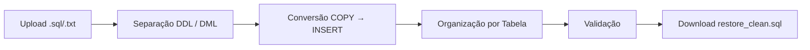

<div align="center">

# SQL Cleaner

[](https://github.com/ESousa97/sql-clean-app/actions/workflows/ci.yml)
[](https://www.codefactor.io/repository/github/esousa97/sql-clean-app)
[](https://opensource.org/licenses/MIT)
[](#)

**Plataforma web para limpeza e transformação de dumps PostgreSQL — upload de arquivo `.sql`/`.txt`, separação automática de estrutura e dados, conversão de blocos `COPY ... FROM stdin` para `INSERT INTO`, processamento em seções para arquivos grandes, geração de `restore_clean.sql` pronto para download. Next.js 15 (App Router) com React 19, TypeScript 5, Tailwind CSS 4 com tokens CSS, Gemini API server-side para análise inteligente e Vitest para testes.**

</div>

---

> **⚠️ Projeto Arquivado**
> Este projeto não recebe mais atualizações ou correções. O código permanece disponível como referência e pode ser utilizado livremente sob a licença MIT. Fique à vontade para fazer fork caso deseje continuar o desenvolvimento.

---

## Índice

- [Sobre o Projeto](#sobre-o-projeto)
- [Funcionalidades](#funcionalidades)
- [Tecnologias](#tecnologias)
- [Como Funciona](#como-funciona)
- [Começando](#começando)
  - [Pré-requisitos](#pré-requisitos)
  - [Instalação](#instalação)
  - [Uso](#uso)
- [Scripts Disponíveis](#scripts-disponíveis)
- [Segurança e Arquitetura](#segurança-e-arquitetura)
- [FAQ](#faq)
- [Licença](#licença)
- [Contato](#contato)

---

## Sobre o Projeto

Plataforma web que transforma dumps PostgreSQL brutos em arquivos SQL limpos e prontos para restore. Nasceu de uma necessidade real de migração de banco de dados sem depender de ferramentas pagas — ao sair de um serviço de banco na Vercel sem orçamento e com urgência de recuperação de dados.

O repositório prioriza:

- **Transformação COPY → INSERT** — Converte blocos `COPY ... FROM stdin` (formato de dump `pg_dump`) para instruções `INSERT INTO` compatíveis com qualquer cliente PostgreSQL, eliminando a dependência de `psql` para restore
- **Processamento em seções** — Arquivos grandes são divididos em blocos para reduzir falhas de memória e permitir transformação incremental, separando estrutura (DDL) e dados (DML) automaticamente
- **Gemini API server-side** — Chave `GEMINI_API_KEY` mantida exclusivamente no servidor (Next.js App Router server components/routes), nunca exposta no front-end, utilizada para análise inteligente do conteúdo SQL
- **Saída organizada por contexto** — O arquivo final `restore_clean.sql` preserva a estrutura de tabelas e organiza os dados por tabela/contexto, facilitando revisão antes do restore
- **Zero custo de plataforma** — Projetado para ser auto-hospedado ou executado localmente, sem dependência de serviços pagos de banco de dados

---

## Funcionalidades

- **Upload de dump** — Aceita arquivos `.sql` ou `.txt` de dumps PostgreSQL (`pg_dump`)
- **Separação estrutura/dados** — Divide automaticamente DDL (CREATE TABLE, ALTER, INDEX) e DML (INSERT/COPY)
- **Conversão COPY → INSERT** — Transforma blocos `COPY ... FROM stdin` com dados tabulados em instruções `INSERT INTO` com valores formatados
- **Processamento em blocos** — Tratamento seccionado para lidar com dumps grandes sem estouro de memória
- **Validação da transformação** — Verificação da saída gerada antes de disponibilizar para download
- **Download do resultado** — Arquivo `restore_clean.sql` pronto para execução em qualquer cliente PostgreSQL
- **Análise com IA** — Gemini API para análise inteligente de contexto e estrutura do dump (server-side)

---

## Tecnologias


---

## Como Funciona



1. **Upload** — O usuário envia o arquivo de dump PostgreSQL pelo navegador
2. **Processamento** — O app divide o dump em seções (estrutura vs dados), converte blocos `COPY ... FROM stdin` para `INSERT INTO` e organiza a saída por contexto de tabela
3. **Resultado** — Arquivo `restore_clean.sql` gerado e disponível para download, pronto para execução em qualquer cliente PostgreSQL

---

## Começando

### Pré-requisitos

```bash
node -v   # >= 20.0.0
npm -v    # >= 10
```

Uma chave de API do Google Gemini — [Obter no AI Studio](https://aistudio.google.com/app/apikey).

### Instalação

```bash
git clone https://github.com/enoquesousa/sql-clean-app.git
cd sql-clean-app
npm install
cp .env.example .env.local
```

Configure `GEMINI_API_KEY` em `.env.local`.

### Uso

```bash
npm run dev
```

Acesse `http://localhost:3000`.

---

## Scripts Disponíveis

```bash
# Desenvolvimento
npm run dev                 # Next.js dev server

# Build
npm run build               # Build de produção
npm run start               # Serve build de produção

# Qualidade
npm run lint                # ESLint
npm run lint:fix            # ESLint com auto-fix
npm run format              # Prettier — formatar
npm run format:check        # Prettier — validar

# Testes
npm run test                # Vitest
npm run test:watch          # Vitest em modo watch
npm run test:coverage       # Vitest com cobertura

# Pipeline local
npm run validate            # lint + test + build
```

---

## Segurança e Arquitetura

- **Gemini API server-side** — A chave `GEMINI_API_KEY` é acessível apenas em server components e API routes do Next.js App Router, nunca exposta no bundle do cliente
- **Processamento em seções** — Dumps são processados em blocos para evitar estouro de memória em arquivos grandes
- **Sem persistência de dados** — Arquivos enviados são processados em memória e descartados; o resultado é gerado para download imediato
- **Saída organizada** — O arquivo final preserva a estrutura de tabelas (DDL) e organiza os dados (DML) por contexto, facilitando revisão e restore seletivo

---

## FAQ

<details>
<summary><strong>Que tipo de dump é compatível?</strong></summary>

Dumps gerados por `pg_dump` no formato SQL (plain text), incluindo arquivos `.sql` e `.txt`. O processamento foca em blocos `COPY ... FROM stdin` (formato padrão do `pg_dump`) e os converte para `INSERT INTO`. Dumps em formato custom (`-Fc`) ou directory (`-Fd`) não são suportados.
</details>

<details>
<summary><strong>Por que converter COPY para INSERT?</strong></summary>

Blocos `COPY ... FROM stdin` requerem o cliente `psql` para restore. Instruções `INSERT INTO` são universais e funcionam em qualquer cliente PostgreSQL (DBeaver, pgAdmin, DataGrip, etc.), além de serem mais fáceis de inspecionar e editar manualmente.
</details>

<details>
<summary><strong>Existe limite de tamanho de arquivo?</strong></summary>

O processamento em seções permite lidar com dumps grandes, mas o limite prático depende da memória disponível no servidor e dos limites de upload do Next.js. Para dumps muito grandes (>100MB), considere dividir o arquivo antes do upload.
</details>

<details>
<summary><strong>Meus dados ficam armazenados no servidor?</strong></summary>

Não. Os arquivos são processados em memória e descartados após a geração do resultado. O download é imediato e nenhum dado é persistido no servidor.
</details>

---

## Licença

Este projeto está sob a licença MIT. Veja o arquivo [LICENSE](LICENSE) para mais detalhes.

```
MIT License - você pode usar, copiar, modificar e distribuir este código.
```

---

## Contato

**José Enoque Costa de Sousa**

[](https://www.linkedin.com/in/enoque-sousa-bb89aa168/)
[](https://github.com/ESousa97)
[](https://enoquesousa.vercel.app)

---

<div align="center">

**[⬆ Voltar ao topo](#sql-cleaner)**

Feito com ❤️ por [José Enoque](https://github.com/ESousa97)

**Status do Projeto:** Archived — Sem novas atualizações

</div>
